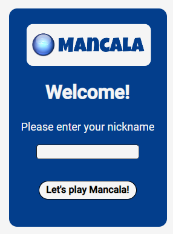
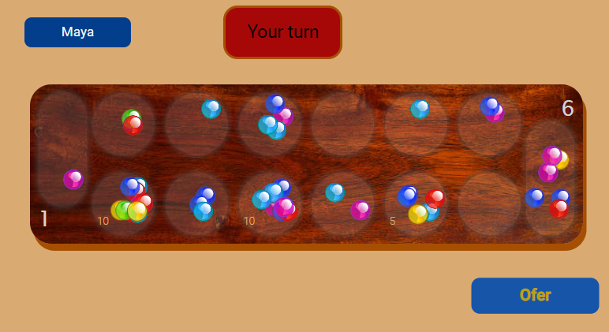

# Mancala Game

# About

### What is Mancala?

- Mancala is an ancient board game played mainly on the African continent.
- The game has many different versions, all of which are based on the same game board - an elongated wooden board with pits in it. Beans, small stones, seeds or beads are used as play tools.

### How to play Mancala?

- In his turn - a player picks up all the beans from one of the pits, and places them one by one in the next pits in a counterclockwise motion.
- The pits at the edges of the board are called "Mankela" - this is the "bank" of the player. The object of the game is to accumulate as many beans as possible in the bank.
- There are dozens of different versions of the game, but the above principles are common to all.

- **You can see in [this link](https://www.youtube.com/watch?v=-A-djjimCcM/ 'Game instructions') the game instructions for the version in this application.**

# The App

## How to connect

- Upon initial login you will be asked to enter a nickname
  

- The client connects to the server via SocketIO and enters the "waiting room"
- When another client connects to the server (A leaves the game room but remains connected to the server) - the server creates a new game room with a unique ID, and puts the 2 players into it.
  
- When a player leaves the app - the other player receives a notification, and can choose to return to the "waiting room"

### Note! The game will only start when an opponent connects, **until then you will be in the waiting room!**

## Communication between the players

The communication between the players is carried out via websocket (SocketIO), and consists of 3 events:

- Game is starting - the server enters 2 players into a new game room, with a unique ID, and randomly chooses which of them will play first.
- A move - when it's player A's turn - he sends player B the pit from which the move will start.
- Disconnection - when a player disconnects while in a game room - the server informs the opponent that he is left alone in the room and the game is stopped.

## How is the move done?

The move is performed on the client side only, recursively, using a generic function that handles both the player's moves and the opponent's moves.

- The function receives the starting point for the move, as well as whether it is the turn of the player or the opponent.
- At the end of each move - a check of the completion status is carried out:
  - If there are no possible moves left, the game ends
  - If the move ended in the player's bank, he gets another turn
  - If the move ended in an empty hole, the turn changes
    

# technologies

## ThechStack

The client side uses React and SocketIO

The server uses SocketIO over Express, as well as UniqueID.js

## deployment

Both the client side and the server side are deployed on the Heroku server as a single repository

# What next?

There are tons more things to do to make the game even cooler!

**Mainly - adding a database**, this will allow:

- User registration - option to use Google Identity, verification through emails, management of encrypted passwords.
- Registering a record table.
- Option to choose which player to play against.
- Option to invite friends via email/social networks
